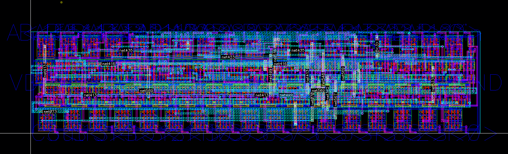

# 16-bit Brent-Kung Full Adder Schematic &amp; Layout for 45nm Technology in Cadence Virtuoso

### How to use the files?

If you want to check out the adder you need Cadence Virtuoso. And if you have Cadence Virtuoso you probably know what you are doing. The schematics and layouts rely on the [FreePDK45 45nm Technology](https://eda.ncsu.edu/freepdk/freepdk45/) library that provides PMOS and NMOS transistors. All gates are based on that library, so if you cannot install it then you won't be able to use the adder.

Get [FreePDK45 45nm Technology](https://eda.ncsu.edu/freepdk/freepdk45/) and then open the `zbetter_adder_test` schematic. Then, you can run a transient analysis and checkout the voltages of the output 16-bit bus.